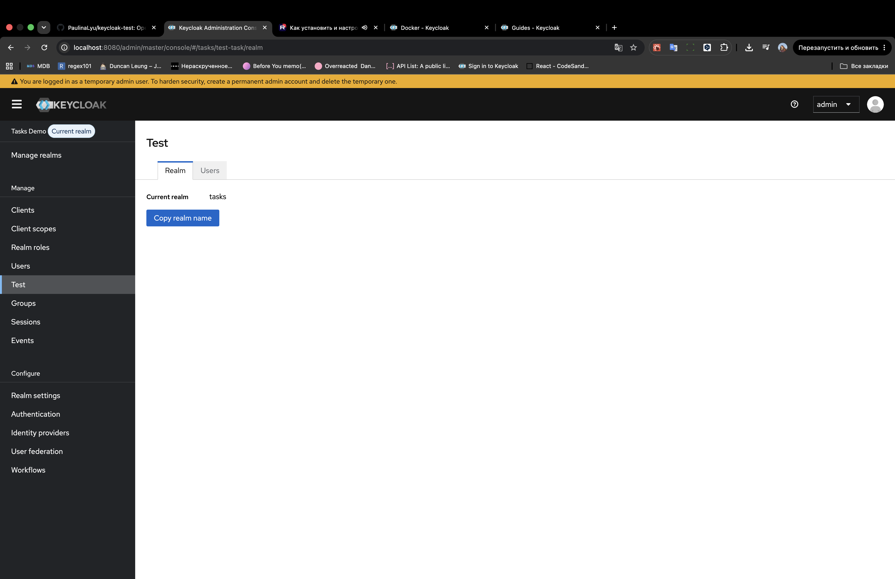
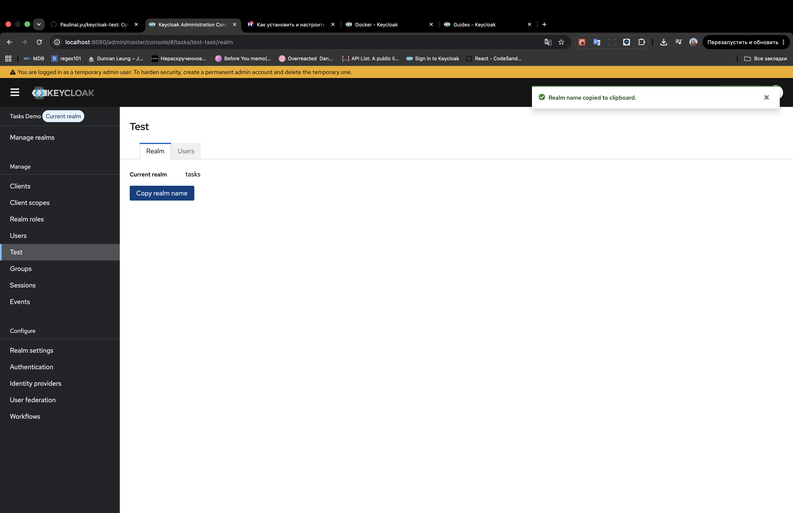
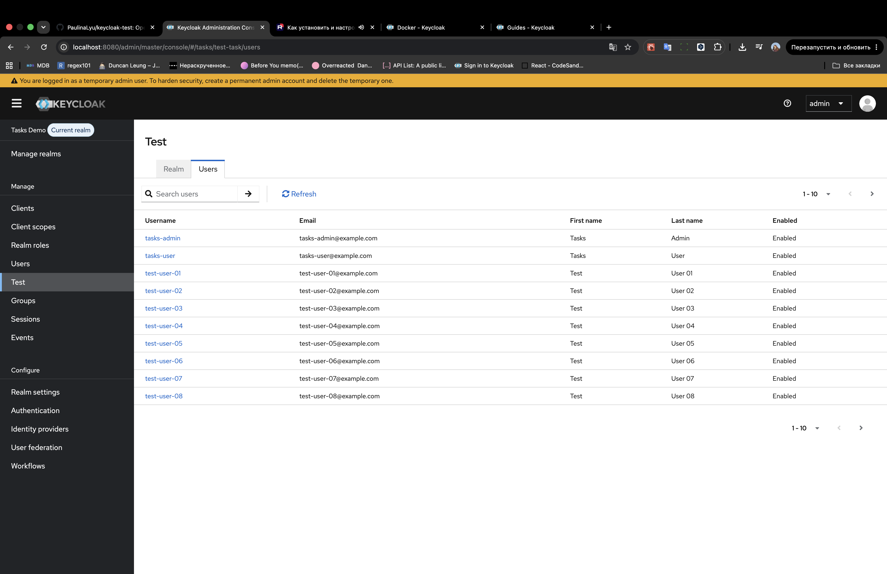
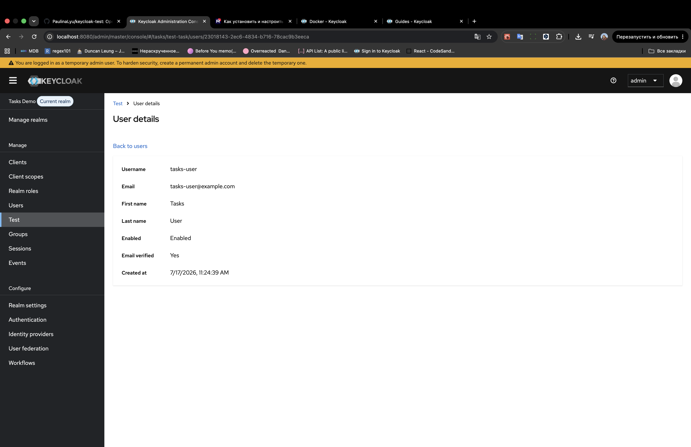
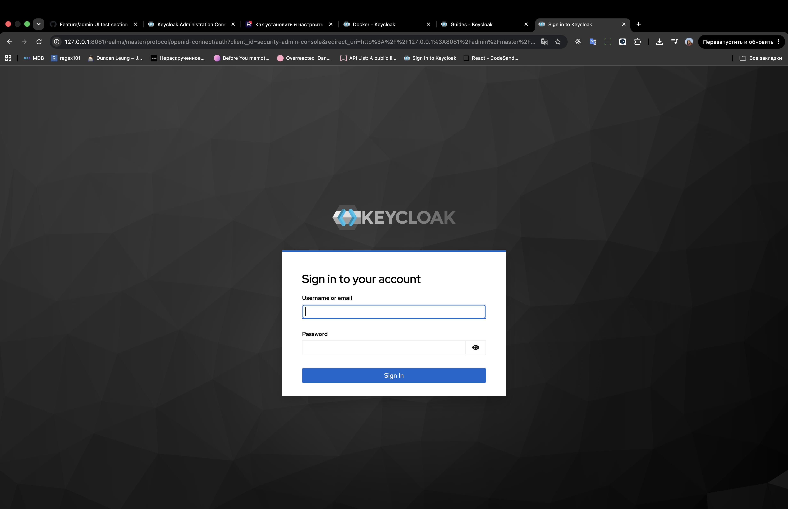
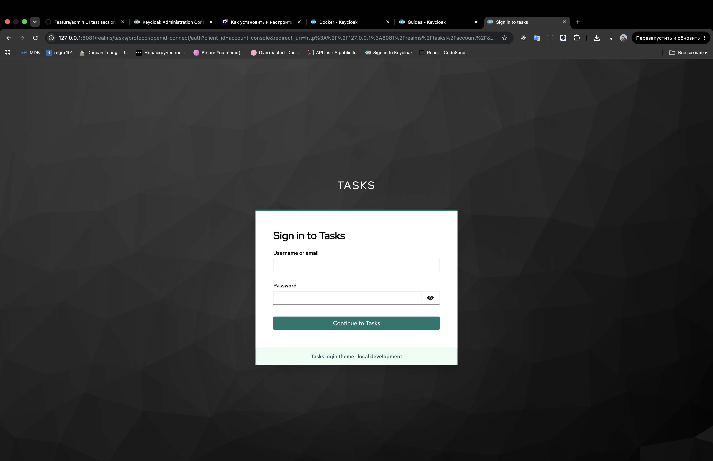
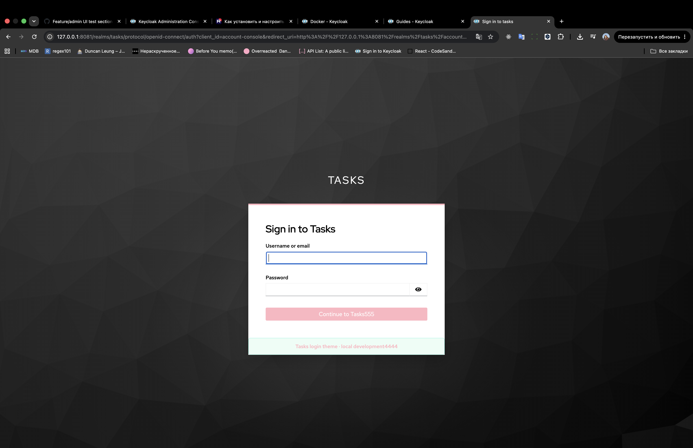

# Тестовое задание: Admin UI + Login Theme

Скриншоты (PNG): [`docs/test-task/proof/`](docs/test-task/proof/)

> Admin UI: `localhost:8080` + Vite.  
> Theme proof: Docker на `127.0.0.1:8081`.

---

## Базовые требования

- **Java 17+** (для Keycloak backend / Admin UI)
- **Node.js** и **pnpm** (workspace в `js/`)
- **Docker** и **Docker Compose** (для theme proof)

---

## Задача 1. Admin UI

### 1. Установка зависимостей

```bash
cd js
pnpm install
```

### 2. Запуск Keycloak backend (`--admin-dev`)

Из каталога `js/` (терминал 1):

```bash
pnpm --filter keycloak-server start --admin-dev
```

### 3. Запуск Admin UI (Vite)

Из каталога `js/` (терминал 2):

```bash
pnpm --filter @keycloak/keycloak-admin-ui run dev
```

```text
http://localhost:8080/admin/master/console/
```

Вход: `admin` / `admin`.

### 4. Demo realm `tasks` и тестовые пользователи

В Admin Console:

1. Создайте realm **`tasks`**.
2. В realm `tasks` создайте realm roles:
   - `role_user`
   - `role_admin`
3. Создайте пользователей:

| Username      | Password    | Email                     | Roles                     |
| ------------- | ----------- | ------------------------- | ------------------------- |
| `tasks-admin` | `Admin123!` | `tasks-admin@example.com` | `role_user`, `role_admin` |
| `tasks-user`  | `User123!`  | `tasks-user@example.com`  | `role_user`               |

4. Для каждого пользователя задайте пароль (Credentials) и role mapping (Realm roles).

Переключите realm selector на **`tasks`**.

### 5. Новый раздел

В сайдбаре пункт **Test**.

Маршруты:

- `/:realm/test-task` — вкладка Realm по умолчанию
- `/:realm/test-task/realm`
- `/:realm/test-task/users`
- `/:realm/test-task/users/:id` — read-only карточка

### 6. Проверка

- **Realm:** отображается имя текущего realm; Copy копирует имя; появляется success alert.
- **Users:** таблица пользователей текущего realm (username, email, first/last name, enabled); поиск и пагинация.
- **User details:** клик по username открывает read-only карточку; стандартный раздел Users по-прежнему редактируемый.
- **Локализация:**
  - EN: тексты раздела Test читаемые (не сырые ключи вроде `testTask`).
  - RU: ключи `testTask*` есть в `messages_ru.properties`.

### 7. Отчет

Вкладка Realm с именем realm и кнопкой Copy:



Success alert после Copy:



Таблица пользователей:



Read-only карточка пользователя:



---

## Задача 2. Login theme

Каталог: `theme-dev/`.

### 1. Запуск

```bash
cd theme-dev
docker compose up
```

Admin Console темы:

```text
http://127.0.0.1:8081/admin
```

Вход: `admin` / `admin`.

При старте импортируется realm **`tasks`** с login theme `test-login-theme` и пользователем `demo` / `demo`.

### 3. Открыть login page

Рекомендуемый путь (форма логина + корректный возврат в Account Console):

```text
http://127.0.0.1:8081/realms/tasks/account/
```

Ожидаемые отличия от дефолтной темы:

- баннер логотипа `Tasks Login Theme`
- заголовок `Sign in to Tasks`
- кнопка `Continue to Tasks`
- бирюзовый accent
- footer `Tasks login theme · local development`

### 4. Hot reload

1. Измените файл темы, например:
   - `theme-dev/themes/test-login-theme/login/messages/messages_en.properties`
   - `theme-dev/themes/test-login-theme/login/resources/css/custom.css`
   - `theme-dev/themes/test-login-theme/login/footer.ftl`
2. Обновите страницу логина в браузере.
3. Изменение видно **без** `docker build` и без пересборки Keycloak (theme cache отключён в compose).

### 5. Остановка

```bash
docker compose down
```

### 6. Отчет

Дефолтная login page:



Кастомная theme (title, button, css, banner, footer):



Результат hot reload после правки CSS/messages:



---
